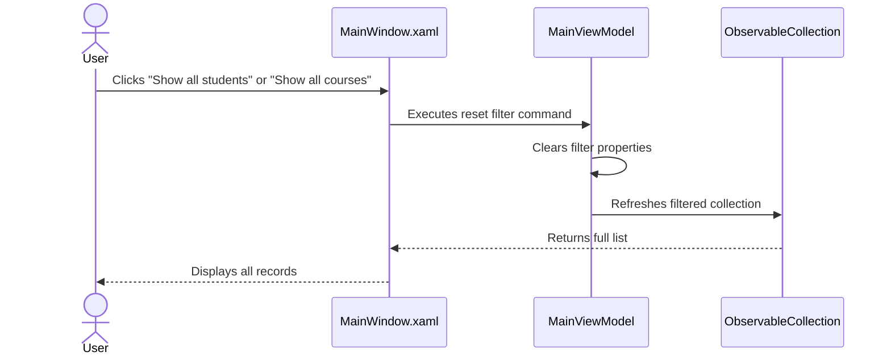

# Flow: Reset Student and Course Filters

```mermaid
sequenceDiagram
    actor User
    participant View as MainWindow.xaml
    participant VM as MainViewModel
    participant Data as ObservableCollection

    User->>View: Clicks "Show all students" or "Show all courses"
    View->>VM: Executes reset filter command
    VM->>VM: Clears filter properties
    VM->>Data: Refreshes filtered collection
    Data-->>View: Returns full list
    View-->>User: Displays all records
```