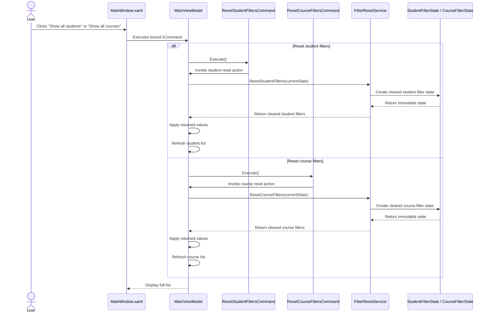

# Flow: Reset Student and Course Filters

## Pattern Used

This flow applies the Command Pattern.

The reset actions are represented as command objects that implement `ICommand`. The ViewModel exposes these commands to the View, while the pure reset logic remains inside `FilterResetService`.

## Dependencies

- `MainWindow.xaml` binds buttons to ViewModel commands.
- `MainViewModel` owns state and applies returned reset values.
- `ResetStudentFiltersCommand` and `ResetCourseFiltersCommand` encapsulate user-triggered actions.
- `FilterResetService` performs deterministic reset calculations.
- `StudentFilterState` and `CourseFilterState` represent input and output state.
