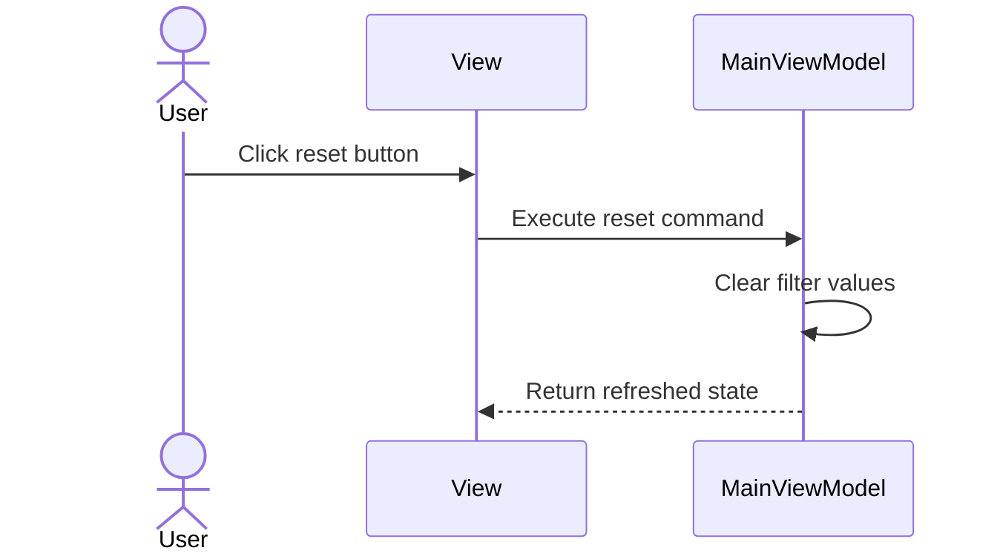

# Pure Function Prompt

Using the following BDD requirements and Mermaid sequence diagram, write the logic for the reset filters feature as a Pure Function in C#.

STRICT RULES:
- No side effects
- No UI access
- No database access
- No MessageBox
- No ObservableCollection modifications
- No mutable global state
- The function must return a predictable output

BDD Requirements:

# Feature: Reset Student and Course Filters

## User Story

As a user, I want to reset active student and course filters so that I can quickly return to the full list without manually clearing each field.

## Acceptance Criteria

### AC1: Reset student filters

Given the student list has active filters  
When the user clicks the "Show all students" button  
Then all student filter fields are cleared and the full student list is displayed

### AC2: Reset course filters

Given the course list has active filters  
When the user clicks the "Show all courses" button  
Then all course filter fields are cleared and the full course list is displayed

Mermaid Diagram:

